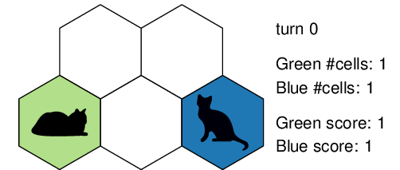
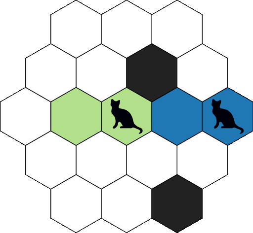

Game description
================
hexabomb is a network multi-player (multi-agent) game, intended to be played by bots.
The game is strongly inspired by Bomberman and Splatoon, with hexagons.

Each player controls characters that move on a board.
A color is associated to each player.
The goal of each player is to have the largest numbers of cell of its color in the board.

For this purpose, the characters color the cells they go through.
Additionally, the characters may drop bombs that color surrounding cells when they explode.

Board
-----
The game board is an hexagonal grid composed of cells.

.. image:: img/board_example.png
   :scale: 100 %
   :alt: Board example

A cell can have up to 6 neighbors (three axes, two directions per axis).
Each cell is identified by its axial coordinates :math:`(q,r)`.
This coordinate system makes sure that different cells have different coordinates,
and that going into a given direction always results in the same coordinate transformations.

.. list-table:: Coordinates transformations from cell :math:`(q,r)` to its neighboring cells.
    :header-rows: 1

    * - Direction
      - Meaning
      - Destination cell
    * - :math:`x^+`
      - towards right
      - :math:`(q+1,r)`
    * - :math:`y^+`
      - towards up and right
      - :math:`(q+1,r-1)`
    * - :math:`z^+`
      - towards up and left
      - :math:`(q,r-1)`
    * - :math:`x^-`
      - towards left
      - :math:`(q-1,r)`
    * - :math:`y^-`
      - towards bottom and left
      - :math:`(q-1,r+1)`
    * - :math:`z^-`
      - towards bottom and right
      - :math:`(q,r+1)`

.. image:: img/offsets.png
   :scale: 100 %
   :alt: coordinates transformations

Cells
-----
Cells can host characters and bombs, and have a color (that can be neutral).
Characters can move into cells if they are empty — i.e., if they do not host characters nor bombs.
Cells can be colored by a bomb if they are in the bomb's explosion range.

.. image:: img/cell_types.png
   :scale: 100 %
   :alt: figuration of cell types

Turns
-----
The game is turn based. All players can do actions on each turn.
All players should respect the following behaviour.

1. Wait for a new turn to start.
2. Receive a new turn (up-to-date board information) from the network.
3. Decide what to do.
4. Send the actions on the network. Start again (goto step 1).

Actions
-------
On each turn each character can either move or drop a bomb.
The exhaustive list of what each character can do is the following.

- Do nothing.
- **move**: Move one cell towards one of the 6 directions.
  The character must be alive. The target cell must exist and be empty.
- **bomb**: Drop a bomb in the character current cell.
  The character must be alive and its cell must NOT contain a bomb.
- **revive**: Revive a dead character on a given cell.
  The character must have been dead for at least 3 turns. The target cell must exist and be empty.

hexabomb will apply the players' decisions in best effort.
In case of conflicts, the faster player is priority.

Objective and score
-------------------
At the end of the game, the player with the highest score wins the game.

The score of each player is the cumulated number of cells it controlled throughout the turns.
In other words, at the end of each turn, the score of each player is increased by the number of
cells of the player's color.

As an example, consider the following 5-cell board on which 2 players (Blue and Green) play.

At the beginning, Blue and Green control the same number of cells (1) and have the same score (1).

On first turn, Blue moves while Green does not.
This allows Blue to earn 2 points this turn, while Green only earns 1 point.

Green remains motionless in the next turns, while Blue controls more and more cells.
As a result, Blue's score increases way more than Green's.

Bombs
-----
Bombs can be dropped by characters on their current cell.
Bombs explode after a given **delay** and have a **range**.
Upon explosion, bombs color the cells of their explosion area with the color
of the player that dropped the bomb — killing any character and exploding any bomb present in the explosion area.

Bombs explode in straight lines in all 6 directions and cover up to *range*
cells in each direction. A line is stopped if it encounters a non-existing cell — or after *range* cells have been covered.

The animation below shows a simple game scenario involving a bomb.

1. On first turn, Green drops a bomb (delay=3, range=2).
2. On second and third turns, Green moves away from the explosion area.
3. Green does no action during fourth turn.
   At the end of the turn, the bomb explodes as its delay reaches 0.
   The explosion area is highlighted in orange.
   At the end of the fourth turn, all the cells of the explosion range have been colored in green.
   Blue is killed in the process as it was in the explosion area.

Simultaneous explosions
~~~~~~~~~~~~~~~~~~~~~~~
Several bombs can explode at the same time.
This may happen when the delay of several bombs reaches 0 at the same time or in case of `Chain reaction`_.

Simultaneous explosions can lead to conflicts about the coloration of the cells — as some cells can be in the explosion area of several bombs of different colors.
The final color of an exploded cells is only determined by the bombs that
explode the cell — and by the distance of these bombs to the exploded cell.
This is how the color of such a cell is computed.

1. If the cell is strictly closer to one bomb than the others, the cell is colored by the color of the closest bomb.
2. If all the bombs of the set of the closest bombs to that cell have the same color, the cell is colored by the color of the bombs.
3. Otherwise (i.e., if any two bombs of the set of the closest bombs to that cell have different colors), the cell color is turned to neutral.

Simultaneous explosions are figured just below.
In this example, all the bombs have a range of 3 cells.

.. image:: img/explosion_simultaneous.gif
   :scale: 100 %
   :alt: figuration of simultaneous explosions

Most of the exploded cells are closer to one bomb from the others and take the bomb's color.
The interesting cells are thickly bordered orange.

- Cells at :math:`(1,-3)`, :math:`(2,-2)` and :math:`(3,-1)` become green because the two closest bombs that explode each cell are green.
- Cell at :math:`(1,0)` stays neutral because the set of the closest bombs that explode the cell contains bombs of different colors.
- Cell at :math:`(-1,2)` becomes green because it is only covered by the green bomb at :math:`(2,-1)`. This may seem counterintuitive because of the blue bomb at :math:`(0,0)` that prevented cells at :math:`(1,0)` and :math:`(0,1)` to turn green. **Explosions cannot reduce the explosion range of each other, they can only interfere with the final color of the exploded cells.**

Chain reaction
~~~~~~~~~~~~~~
Without any external influence, a bomb explodes when its delay reaches 0.
A bomb can however explode before reaching a delay of 0 because of another bomb.
This happens when a bomb is in the explosion area of another bomb (and when
the other bomb explodes first). This can lead to a chain reaction where many
bombs can explode at the same time.

If a chain reaction involves bombs of different colors,
see `Simultaneous explosions`_ to understand how the cells of the explosion areas are colored.

.. image:: img/explosion_chain_reaction.gif
   :scale: 100 %
   :alt: figuration of explosions in chain reaction

.. _breadth-first search: https://en.wikipedia.org/wiki/Breadth-first_search

Characters life and death
-------------------------

Characters can die because of Bombs_.

A dead character is removed from the board — thus making the character's cell traversable.

A character death does not imply any direct score penalty on the dead character's player.
However an indirect penalty still exists, as a dead character cannot do any action for at least 3 turns.
After these 3 turns, the character can be revived via a *revive* action (see Actions_).
