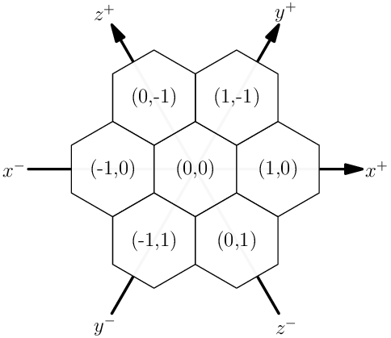

Game description
================

Introduction. TODO

Objective
---------
TODO

Actions
-------
TODO

Board
-----

The game board is an hexagonal grid composed of cells.

TODO: insert an example game board.

A cell can have up to 6 neighbors (three axes, two directions per axis).
Each cell is identified by its axial coordinates :math:`(q,r)`.
This coordinate system makes sure that different cells have different coordinates.
Furthermore, going into a direction always results in the same coordinate transformations.

.. list-table:: Coordinates transformations from cell :math:`(q,r)` to its neighboring cells.
    :header-rows: 1
    :stub-columns: 1

    * - Direction
      - Meaning
      - Destination cell
    * - :math:`x^+`
      - towards right
      - :math:`(q+1,r)`
    * - :math:`y^+`
      - towards up and right
      - :math:`(q+1,r-1)`
    * - :math:`z^+`
      - towards up and left
      - :math:`(q,r-1)`
    * - :math:`x^-`
      - towards left
      - :math:`(q-1,r)`
    * - :math:`y^-`
      - towards bottom and left
      - :math:`(q-1,r+1)`
    * - :math:`z^-`
      - towards bottom and right
      - :math:`(q,r+1)`

Cell
----
TODO

Score
-----
TODO

Turn
----
TODO
