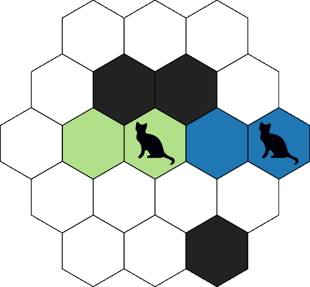

Game description
================

hexabomb is a network multi-agent (multi-player) game, intended to be played by bots.
The game is strongly inspired by Bomberman and Splatoon, with hexagons.

Each agent controls characters that move on a board.
A color is associated to each agent.
The goal of each agent is to have the largest numbers of cell of its color in the board.

For this purpose, the characters color the cells they go through.
Additionally, the characters may drop bombs that color surrounding cells when they explode.

Board
-----

The game board is an hexagonal grid composed of cells.

.. image:: img/board_example.png
   :scale: 100 %
   :alt: Board example

A cell can have up to 6 neighbors (three axes, two directions per axis).
Each cell is identified by its axial coordinates :math:`(q,r)`.
This coordinate system makes sure that different cells have different coordinates,
and that going into a given direction always results in the same coordinate transformations.

.. list-table:: Coordinates transformations from cell :math:`(q,r)` to its neighboring cells.
    :header-rows: 1

    * - Direction
      - Meaning
      - Destination cell
    * - :math:`x^+`
      - towards right
      - :math:`(q+1,r)`
    * - :math:`y^+`
      - towards up and right
      - :math:`(q+1,r-1)`
    * - :math:`z^+`
      - towards up and left
      - :math:`(q,r-1)`
    * - :math:`x^-`
      - towards left
      - :math:`(q-1,r)`
    * - :math:`y^-`
      - towards bottom and left
      - :math:`(q-1,r+1)`
    * - :math:`z^-`
      - towards bottom and right
      - :math:`(q,r+1)`

.. image:: img/offsets.png
   :scale: 100 %
   :alt: coordinates transformations

Cells
-----
Two types of cells exist on the board: **usual cells** and **walls**.

Usual cells can host characters and bombs, and have a color (that can be neutral).
Players can move into usual cells if they are empty — i.e., if they do not host characters nor bombs.
Usual cells can be colored by a bomb if they are in the bomb's explosion range.

Contrary to usual cells, walls are obstacles without color.
Characters cannot move into walls.
Bombs cannot traverse walls.
Thin bomb explosions are completely stopped by walls,
while fat bomb explosions can circumvent them.

.. image:: img/cell_types.png
   :scale: 100 %
   :alt: figuration of cell types

Bombs
-----
Bombs can be dropped by characters on their current cell.
Bombs explode after a given **delay** and have a **range**.
Upon explosion, bombs color the cells of their explosion area with the color
of the player that dropped the bomb — killing any character present in the explosion area in the process.

The explosion area of a bomb can be determined from its range and its **type**,
which is either *thin* or *fat*.

Thin bombs
~~~~~~~~~~
Thin bombs explode in straight lines in all 6 directions and cover up to *range*
cells in each direction. A line is stopped if it encounters a wall — or after *range* cells have been covered.

The animation below shows a simple game scenario involving a thin bomb.

1. On first turn, Green drops a thin bomb (delay=3, range=2) and moves away from it.
2. On second turn, Green moves away from the bomb explosion area.
3. On third turn, nothing happens.
4. During fourth turn, the bomb explodes as its delay reaches 0.
   The explosion area is highlighted in orange.
   At the end of the fourth turn, all the cells of the explosion range have been colored in green.
   Blue is killed in the process as it was in the explosion area.

.. image:: img/explosion_thin.gif
   :scale: 100 %
   :alt: figuration of a thin bomb lifecycle

Fat bombs
~~~~~~~~~
Fat bombs explode all the cells that can be reached by traversing *range* cells or less — walls cannot be traversed.
This means that fat bombs can circumvent walls.
The explosion range can be computed with a `breadth-first search`_ algorithm with depth limited to *range*.

The animation below shows a simple game scenario involving a fat bomb.

1. On first turn, Green drops a fat bomb (delay=3, range=2) and moves away from it.
2. On second turn, Green moves away from the bomb but remains in its explosion area.
3. On third turn, nothing happens.
4. During fourth turn, the bomb explodes as its delay reaches 0.
   The explosion area is highlighted in orange.
   At the end of the fourth turn, all the cells of the explosion range have been colored in green.
   Both Blue and Green are killed in the process as they were in the explosion area.

Actions
-------
TODO

Objective and score
-------------------
At the end of the game, the agent with the highest score wins the game.

The score of each agent is the cumulated number of cells it controlled throughout the turns.
In other words, at the end of each turn, the score of each player is increased by the number of
cells of the player's color.

As an example, consider the following 5-cell board on which 2 players (Blue and Green) play.
At the beginning, Blue and Green control the same number of cells (1) and have the same score (1).

.. image:: img/score_turn0.png
   :scale: 100 %
   :alt: score turn 0

On first turn, Blue moves while Green does not.
This allows Blue to earn 2 points this turn, while Green only earns 1 point.

.. image:: img/score_turn1.png
   :scale: 100 %
   :alt: score turn 1

Green remains motionless in the next turns, while Blue controls more and more cells.
As a result, Blue's score increases way more than Green's.

.. image:: img/score_turn2.png
   :scale: 100 %
   :alt: score turn 2

.. image:: img/score_turn3.png
   :scale: 100 %
   :alt: score turn 3

Turn
----
TODO

.. _breadth-first search: https://en.wikipedia.org/wiki/Breadth-first_search
